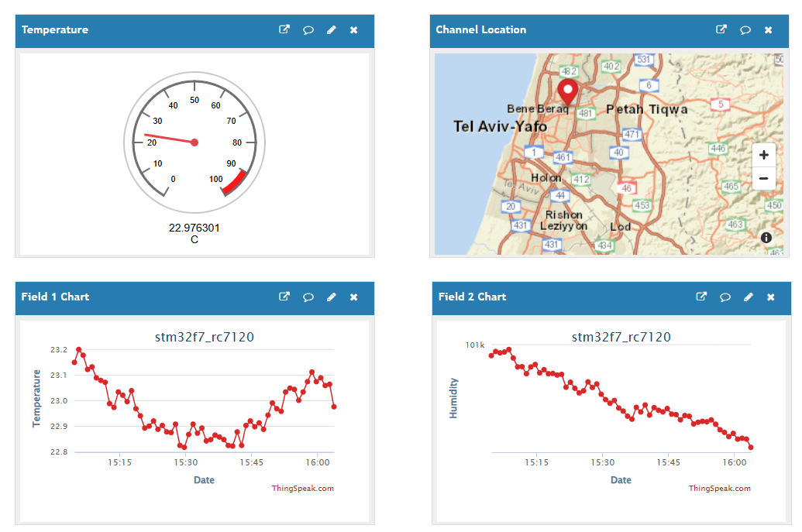

# IoT_SensorHab_Tracker_STM32

## Description

IoT_SensorHab_Tracker_STM32 is a comprehensive embedded IoT solution built on the STM32F756ZG microcontroller platform. This project implements a multi-sensor data acquisition system that collects environmental data (temperature, humidity, pressure), motion data (accelerometer, gyroscope), and GPS location data. The system features robust data logging to flash memory and real-time data transmission via MQTT over cellular connectivity.

The project utilizes FreeRTOS for concurrent task management, ensuring thread-safe operations across multiple sensor interfaces. Data is transmitted to cloud platforms like ThingSpeak for remote monitoring and analysis, making it ideal for environmental monitoring, asset tracking, and IoT research applications.

link for data analysis: [ThingSpeak](https://thingspeak.mathworks.com/channels/2956054)



## Features

- **Multi-Sensor Data Collection:**
  - Environmental monitoring (BME280): Temperature, humidity, barometric pressure
  - Motion sensing (MPU6050): 3-axis accelerometer and gyroscope with DMP support
  - GPS positioning (Neo-6M): Location, altitude, speed tracking
  
- **Robust Data Management:**
  - Flash memory data logging (W25Q64) with ring buffer implementation
  - Thread-safe sensor data aggregation and queuing
  - Configurable data sampling rates and buffer sizes

- **Cellular Connectivity:**
  - MQTT data transmission via Sierra Wireless RC7120 Cat1Bis LTE modem
  - AT command parser (uAT) with FreeRTOS integration
  - Automatic network attachment and connection management

- **Real-time Operating System:**
  - FreeRTOS-based task management
  - Thread-safe I2C and UART in DMA mode operations with mutex protection
  - Configurable task priorities and stack sizes

- **Flexible Configuration:**
  - Header-based feature enable/disable system
  - Configurable debug output and logging levels
  - Modular sensor driver architecture

## Getting Started

### Prerequisites

**Hardware Requirements:**

- STM32F756ZG Nucleo development board
- GY-MPU6050 6-axis IMU module
- GY-BME280 environmental sensor module
- GY-W25Q64 SPI flash memory module
- Sierra Wireless RC7120 Cat1Bis LTE modem
- GY-Neo6M UBlox GNSS module
- Appropriate connecting wires and breadboard

**Software Requirements:**

- STM32CubeMX (latest version)
- Visual Studio Code with STM32 Extension Pack
- ARM GCC toolchain (arm-none-eabi-gcc)
- ST-Link utility or STM32CubeProgrammer
- Git for version control

**Development Tools:**

- STM32CubeIDE (alternative to VSCode setup)
- Serial terminal application (PuTTY, Tera Term, or similar)
- MQTT client for testing (MQTT Explorer, mosquitto_pub/sub)

### Installation

1. **Clone the Repository:**

   ```bash
   git clone https://github.com/yourusername/IoT_SensorHab_Tracker_STM32.git
   cd IoT_SensorHab_Tracker_STM32
   ```

2. **Hardware Setup:**
   - Connect sensors to STM32 Nucleo board according to pin assignments
   - Connect Sierra Wireless RC7120 modem via UART
   - Connect GPS module via UART
   - Ensure proper power supply connections
   - *Detailed wiring diagrams will be provided separately*

3. **Software Configuration:**
   - Open project in STM32CubeMX to verify/modify pin configurations
   - Configure MQTT broker settings in `mqtt_secrets.h`
   - Adjust sensor settings in respective header files
   - Enable/disable debug output in configuration headers

4. **Build and Flash:**

use with STM32CubeIDEto build and flash directly:

   ```bash
   # Open project in STM32CubeIDE
   # Build the project
   # Connect STM32 Nucleo via ST-Link and flash the firmware
   ```

## Usage

### Basic Operation

1. **Power On:**
   - Connect STM32 Nucleo to USB for power and debugging
   - System will initialize all sensors and establish cellular connection
   - Monitor initialization via UART3 debug output (115200 baud)

2. **Data Collection:**
   - System automatically starts sensor data collection upon successful initialization
   - BME280: Environmental data every 1 second
   - MPU6050: Motion data every 1 second  
   - GPS: Continuous positioning data
   - Data is logged to flash memory and queued for transmission

3. **MQTT Transmission:**
   - System connects to configured MQTT broker via cellular modem
   - Sensor data transmitted to ThingSpeak channels
   - Status updates and error messages logged via debug UART

### Configuration Examples

**Enable Debug Output:**

```c
// In respective header files
#define DEBUG_PRINT_ENABLED 1
#define BME280_DEBUG_ENABLED 1
#define MPU6050_DEBUG_ENABLED 1
```

**Configure MQTT Settings:**

```c
// In mqtt_secrets.h
#define SECRET_MQTT_CLIENT_ID "your_client_id"
#define SECRET_MQTT_USERNAME "your_username" 
#define SECRET_MQTT_PASSWORD "your_password"
```

**Monitor Output:**

```bash
# Connect to debug UART (115200 baud)
minicom -D /dev/ttyACM0 -b 115200
# or
screen /dev/ttyACM0 115200
```

## Development Environment

- **Operating System:** Cross-platform (Windows, Linux, macOS)
- **Programming Language:** C (C11 standard)
- **Microcontroller:** STM32F756ZG (ARM Cortex-M7, 216MHz)
- **Key Frameworks/Libraries:**
  - STM32 HAL Driver
  - FreeRTOS 10.x
  - CMSIS
  - lwGPS library
  - Custom uAT parser library
  - BME280 and MPU6050 driver libraries
- **Development Tools:**
  - STM32CubeMX for peripheral configuration
  - Visual Studio Code with STM32 Extension Pack
  - ARM GCC Embedded Toolchain
  - ST-Link for debugging and flashing

## Workspace Setup (For Developers)

1. **Clone and Setup Repository:**

   ```bash
   git clone https://github.com/yourusername/IoT_SensorHab_Tracker_STM32.git
   cd IoT_SensorHab_Tracker_STM32
   ```

2. **Install Development Dependencies:**

   **ARM GCC Toolchain:**
   ```bash
   # Ubuntu/Debian
   sudo apt update
   sudo apt install gcc-arm-none-eabi gdb-arm-none-eabi

   # Windows: Download from ARM Developer website
   # https://developer.arm.com/downloads/-/gnu-rm

   # macOS
   brew install --cask gcc-arm-embedded
   ```

   **CMake and Ninja:**
   ```bash
   # Ubuntu/Debian
   sudo apt install cmake ninja-build

   # Windows: Install via Visual Studio installer or chocolatey
   choco install cmake ninja

   # macOS
   brew install cmake ninja
   ```

   **VS Code Extensions:**
   - STM32 VS Code Extension Pack
   - C/C++ Extension Pack  
   - CMake Tools
   - Cortex-Debug extension

3. **Build System Setup:**

   ```bash
   # Configure build system (creates build files automatically)
   cmake --preset Debug

   # Build the project
   ninja -C build/Debug

   # Or use VS Code CMake Tools extension for GUI build
   ```

   **Note:** The removed files (CMakeCache.txt, build.ninja, compile_commands.json) are automatically regenerated by CMake during the configure step. You don't need to manually create them.

4. **Environment Configuration:**
   - Create `mqtt_secrets.h` from template with your MQTT credentials
   - Configure debug settings in header files as needed
   - Verify STM32CubeMX project configuration matches your hardware setup

5. **Development Workflow:**
   - Use STM32CubeMX for peripheral configuration changes
   - Develop application code in `/Core/Src` and `/Core/Inc`
   - Sensor drivers located in `/Drivers` subdirectories
   - Test builds regularly with `cmake --preset Debug && ninja -C build/Debug`
   - Use ST-Link debugger for hardware debugging

6. **Code Style and Testing:**
   - Follow existing code formatting conventions
   - Test sensor functionality individually before integration
   - Verify thread safety with FreeRTOS task priorities
   - Monitor memory usage and stack depth

## Documentation

### Hardware Documentation:
- **BME280 Sensor**: [Official Datasheet](https://www.bosch-sensortec.com/media/boschsensortec/downloads/datasheets/bst-bme280-ds002.pdf)
- **RC76xx Modem**: [AT Command Reference Guide](https://source.sierrawireless.com/resources/airprime/minicard/74xx_series/4117727_rc76xx_atcommand_referencemanual/)
- **STM32F756ZG**: [Reference Manual](https://www.st.com/resource/en/reference_manual/rm0385-stm32f75xxx-and-stm32f74xxx-advanced-armbased-32bit-mcus-stmicroelectronics.pdf)

*Note: Large documentation files are not stored in this repository to keep it lightweight. Please download directly from the official sources above.*

## Contributing

Contributions to improve the IoT SensorHub Tracker are welcome! Please feel free to submit pull requests or open issues for bugs and feature requests. When contributing:

- Follow the existing code structure and naming conventions
- Test changes thoroughly on hardware before submitting
- Update documentation for any new features or configuration options
- Ensure thread safety when modifying FreeRTOS tasks

## License

[MIT LICENSE](LICENSE)
